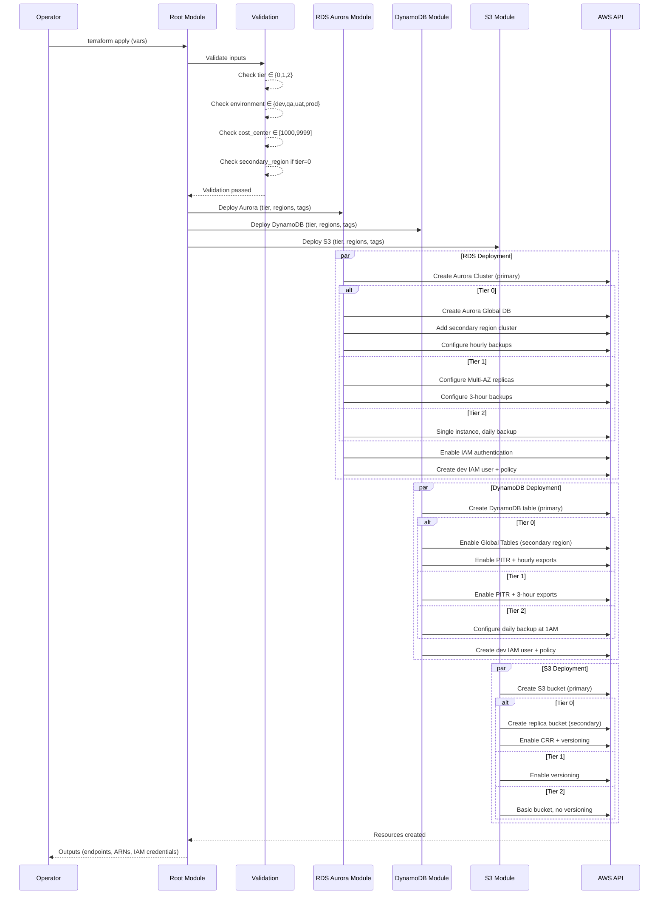
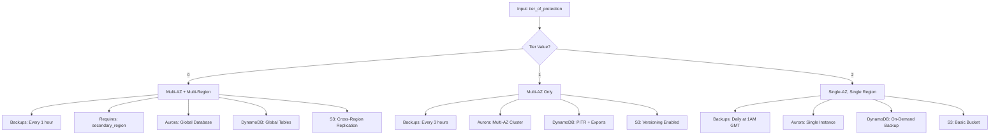

# Design Document: Terraform Tiered AWS Modules

## Overview

This feature provides three reusable Terraform modules for AWS services — RDS Aurora MySQL, DynamoDB, and S3 — each configurable through a tiered protection model (Tier 0, 1, 2). The tier system controls availability, redundancy, and backup strategies, abstracting complex multi-AZ and multi-region configurations behind a simple numeric input.

Each module enforces organizational governance through mandatory tagging (cost_center, project_name, environment), input validation (environment restricted to dev/qa/uat/prod, cost_center to 1000–9999), and sensible defaults for all non-required variables. Database modules (RDS Aurora MySQL and DynamoDB) additionally provision IAM-based authentication with development IAM users, eliminating password-based access patterns.

The design follows a shared-variable pattern where common inputs (tier, regions, workload name, tags) are defined once in a root module and passed consistently to each child module, ensuring uniform behavior across all three services.

## Architecture

```mermaid
graph TD
    Root["Root Module<br/>(terraform-tiered-aws-modules)"]

    Root --> RDS["modules/rds-aurora-mysql"]
    Root --> DDB["modules/dynamodb"]
    Root --> S3["modules/s3"]

    RDS --> RDS_T0["Tier 0: Multi-AZ + Multi-Region<br/>Aurora Global Database<br/>Hourly Backups"]
    RDS --> RDS_T1["Tier 1: Multi-AZ<br/>Single Region Cluster<br/>3-Hour Backups"]
    RDS --> RDS_T2["Tier 2: Single-AZ<br/>Single Region<br/>Daily Backup 1AM GMT"]

    DDB --> DDB_T0["Tier 0: Global Tables<br/>Multi-Region Replicas<br/>PITR + Hourly Exports"]
    DDB --> DDB_T1["Tier 1: Single Region<br/>PITR Enabled<br/>3-Hour Exports"]
    DDB --> DDB_T2["Tier 2: Single Region<br/>On-Demand Backup<br/>Daily at 1AM GMT"]

    S3 --> S3_T0["Tier 0: Cross-Region Replication<br/>Versioning + Hourly Lifecycle<br/>Multi-Region Access Point"]
    S3 --> S3_T1["Tier 1: Single Region<br/>Versioning Enabled<br/>3-Hour Lifecycle"]
    S3 --> S3_T2["Tier 2: Single Region<br/>No Versioning<br/>Daily Lifecycle 1AM GMT"]

    RDS --> IAM_RDS["IAM Authentication<br/>Dev IAM Users"]
    DDB --> IAM_DDB["IAM Policy<br/>Dev IAM Users"]

    subgraph "Shared Inputs"
        Tier["tier_of_protection: 0|1|2"]
        PR["primary_region"]
        SR["secondary_region"]
        WN["workload_name"]
        Tags["tags: cost_center,<br/>project_name, environment"]
    end

    Root -.-> Tier
    Root -.-> PR
    Root -.-> SR
    Root -.-> WN
    Root -.-> Tags
```



## Sequence Diagrams

### Module Deployment Flow



### Tier Decision Flow



## Components and Interfaces

### Component 1: Root Module

**Purpose**: Orchestrates all three service modules, defines shared variables, and passes validated inputs downstream.

**Interface**:
```hcl
# Required inputs — no defaults
variable "tier_of_protection" {
  type        = number
  description = "Protection tier: 0 (multi-AZ + multi-region), 1 (multi-AZ), 2 (single-AZ)"
  validation {
    condition     = contains([0, 1, 2], var.tier_of_protection)
    error_message = "tier_of_protection must be 0, 1, or 2."
  }
}

variable "primary_region" {
  type        = string
  description = "Primary AWS region for all resources"
}

variable "secondary_region" {
  type        = string
  description = "Secondary AWS region for multi-region deployments (required when tier = 0)"
  default     = ""
  validation {
    condition     = var.tier_of_protection != 0 || length(var.secondary_region) > 0
    error_message = "secondary_region is required when tier_of_protection is 0."
  }
}

variable "workload_name" {
  type        = string
  description = "Name of the workload, used for resource naming"
  validation {
    condition     = can(regex("^[a-z0-9-]+$", var.workload_name))
    error_message = "workload_name must be lowercase alphanumeric with hyphens only."
  }
}

variable "cost_center" {
  type        = string
  description = "Cost center code (1000-9999)"
  validation {
    condition     = can(regex("^[0-9]{4}$", var.cost_center)) && tonumber(var.cost_center) >= 1000 && tonumber(var.cost_center) <= 9999
    error_message = "cost_center must be a number between 1000 and 9999."
  }
}

variable "project_name" {
  type        = string
  description = "Project name for tagging"
}

variable "environment" {
  type        = string
  description = "Deployment environment"
  validation {
    condition     = contains(["dev", "qa", "uat", "prod"], var.environment)
    error_message = "environment must be one of: dev, qa, uat, prod."
  }
}
```

**Responsibilities**:
- Validate all shared inputs before passing to child modules
- Construct the common tags map from mandatory tag variables
- Invoke each service module with consistent parameters
- Aggregate and expose outputs from all child modules

### Component 2: RDS Aurora MySQL Module

**Purpose**: Provisions an Aurora MySQL cluster with tier-driven availability, backup configuration, and IAM authentication with dev IAM users.

**Interface**:
```hcl
# modules/rds-aurora-mysql/variables.tf
variable "tier_of_protection" {
  type = number
}

variable "primary_region" {
  type = string
}

variable "secondary_region" {
  type    = string
  default = ""
}

variable "workload_name" {
  type = string
}

variable "tags" {
  type = map(string)
}

# Defaulted variables
variable "engine_version" {
  type    = string
  default = "8.0.mysql_aurora.3.05.2"
}

variable "instance_class" {
  type    = string
  default = "db.r6g.large"
}

variable "instance_count" {
  type    = number
  default = 2
}

variable "database_name" {
  type    = string
  default = "app"
}

variable "backup_retention_period" {
  type    = number
  default = 7
}

variable "deletion_protection" {
  type    = bool
  default = true
}

variable "storage_encrypted" {
  type    = bool
  default = true
}
```

**Responsibilities**:
- Create Aurora MySQL cluster with tier-appropriate configuration
- Tier 0: Aurora Global Database across primary + secondary regions, hourly automated backups
- Tier 1: Multi-AZ cluster in primary region, 3-hour backup window
- Tier 2: Single-AZ instance, daily backup at 1 AM GMT
- Enable IAM database authentication on all tiers
- Create development IAM user with RDS connect policy
- Apply mandatory tags to all resources

### Component 3: DynamoDB Module

**Purpose**: Provisions a DynamoDB table with tier-driven replication, backup strategy, and IAM authentication with dev IAM users.

**Interface**:
```hcl
# modules/dynamodb/variables.tf
variable "tier_of_protection" {
  type = number
}

variable "primary_region" {
  type = string
}

variable "secondary_region" {
  type    = string
  default = ""
}

variable "workload_name" {
  type = string
}

variable "tags" {
  type = map(string)
}

# Defaulted variables
variable "billing_mode" {
  type    = string
  default = "PAY_PER_REQUEST"
}

variable "hash_key" {
  type    = string
  default = "id"
}

variable "hash_key_type" {
  type    = string
  default = "S"
}

variable "range_key" {
  type    = string
  default = ""
}

variable "range_key_type" {
  type    = string
  default = "S"
}

variable "enable_encryption" {
  type    = bool
  default = true
}

variable "table_class" {
  type    = string
  default = "STANDARD"
}
```

**Responsibilities**:
- Create DynamoDB table with tier-appropriate configuration
- Tier 0: Enable Global Tables with secondary region replica, PITR enabled, hourly backup exports to S3
- Tier 1: Single region, PITR enabled, 3-hour backup exports
- Tier 2: Single region, scheduled on-demand backup daily at 1 AM GMT via AWS Backup
- Create development IAM user with DynamoDB access policy
- Apply mandatory tags to all resources

### Component 4: S3 Module

**Purpose**: Provisions an S3 bucket with tier-driven replication, versioning, and lifecycle policies.

**Interface**:
```hcl
# modules/s3/variables.tf
variable "tier_of_protection" {
  type = number
}

variable "primary_region" {
  type = string
}

variable "secondary_region" {
  type    = string
  default = ""
}

variable "workload_name" {
  type = string
}

variable "tags" {
  type = map(string)
}

# Defaulted variables
variable "force_destroy" {
  type    = bool
  default = false
}

variable "block_public_access" {
  type    = bool
  default = true
}

variable "sse_algorithm" {
  type    = string
  default = "aws:kms"
}

variable "noncurrent_version_expiration_days" {
  type    = number
  default = 90
}
```

**Responsibilities**:
- Create S3 bucket with tier-appropriate configuration
- Tier 0: Enable versioning, cross-region replication to secondary region bucket, multi-region access point
- Tier 1: Enable versioning, single region
- Tier 2: No versioning, basic bucket, single region
- Block public access on all tiers
- Server-side encryption (KMS) on all tiers
- Apply mandatory tags to all resources

## Data Models

### Common Tags Map

```hcl
locals {
  common_tags = {
    cost_center  = var.cost_center
    project_name = var.project_name
    environment  = var.environment
    workload     = var.workload_name
    managed_by   = "terraform"
  }
}
```

**Validation Rules**:
- `cost_center`: String matching `^[0-9]{4}$`, numeric value between 1000 and 9999
- `environment`: Must be one of `dev`, `qa`, `uat`, `prod`
- `project_name`: Non-empty string
- `workload_name`: Lowercase alphanumeric with hyphens (`^[a-z0-9-]+$`)

### Tier Configuration Map

```hcl
locals {
  tier_config = {
    0 = {
      multi_az           = true
      multi_region       = true
      backup_frequency   = "hourly"
      backup_cron        = "cron(0 * * * ? *)"    # every hour
      availability_zones = 3
    }
    1 = {
      multi_az           = true
      multi_region       = false
      backup_frequency   = "3-hourly"
      backup_cron        = "cron(0 */3 * * ? *)"   # every 3 hours
      availability_zones = 3
    }
    2 = {
      multi_az           = false
      multi_region       = false
      backup_frequency   = "daily"
      backup_cron        = "cron(0 1 * * ? *)"     # daily at 1 AM GMT
      availability_zones = 1
    }
  }

  current_tier = local.tier_config[var.tier_of_protection]
}
```

### IAM User Model (Database Modules)

```hcl
locals {
  iam_user_name = "${var.workload_name}-${var.tags["environment"]}-dev-db-user"
}
```


## Key Functions with Formal Specifications

### Function 1: RDS Aurora Cluster Provisioning

```hcl
# modules/rds-aurora-mysql/main.tf

resource "aws_rds_cluster" "primary" {
  cluster_identifier              = "${var.workload_name}-aurora-primary"
  engine                          = "aurora-mysql"
  engine_version                  = var.engine_version
  database_name                   = var.database_name
  master_username                 = "admin"
  manage_master_user_password     = true
  storage_encrypted               = var.storage_encrypted
  deletion_protection             = var.deletion_protection
  backup_retention_period         = var.backup_retention_period
  preferred_backup_window         = local.current_tier.multi_az ? null : "01:00-02:00"
  iam_database_authentication_enabled = true
  availability_zones              = local.current_tier.multi_az ? local.primary_azs : [local.primary_azs[0]]

  # Tier 0: Global database requires global_cluster_identifier
  global_cluster_identifier = local.current_tier.multi_region ? aws_rds_global_cluster.this[0].id : null

  tags = var.tags
}
```

**Preconditions:**
- `var.tier_of_protection` ∈ {0, 1, 2}
- `var.primary_region` is a valid AWS region
- If `tier_of_protection == 0`: `var.secondary_region` is non-empty and different from `var.primary_region`
- `var.workload_name` matches `^[a-z0-9-]+$`

**Postconditions:**
- Aurora MySQL cluster exists in `var.primary_region`
- IAM database authentication is enabled
- If tier 0: Global cluster spans primary and secondary regions
- If tier 1: Cluster has Multi-AZ replicas across 3 AZs
- If tier 2: Single instance in one AZ, backup window at 01:00-02:00 UTC
- All resources tagged with `var.tags`

**Loop Invariants:** N/A (declarative resource)

### Function 2: DynamoDB Table Provisioning

```hcl
# modules/dynamodb/main.tf

resource "aws_dynamodb_table" "this" {
  name         = "${var.workload_name}-table"
  billing_mode = var.billing_mode
  hash_key     = var.hash_key
  table_class  = var.table_class

  attribute {
    name = var.hash_key
    type = var.hash_key_type
  }

  dynamic "attribute" {
    for_each = var.range_key != "" ? [1] : []
    content {
      name = var.range_key
      type = var.range_key_type
    }
  }

  # Tier 0 & 1: Enable PITR
  point_in_time_recovery {
    enabled = var.tier_of_protection <= 1
  }

  # Tier 0: Global table replica
  dynamic "replica" {
    for_each = var.tier_of_protection == 0 ? [var.secondary_region] : []
    content {
      region_name = replica.value
    }
  }

  server_side_encryption {
    enabled = var.enable_encryption
  }

  tags = var.tags
}
```

**Preconditions:**
- `var.tier_of_protection` ∈ {0, 1, 2}
- `var.hash_key` is non-empty
- If `tier_of_protection == 0`: `var.secondary_region` is non-empty
- `var.billing_mode` ∈ {"PAY_PER_REQUEST", "PROVISIONED"}

**Postconditions:**
- DynamoDB table exists with specified hash key
- If tier 0: Global table replica in secondary region, PITR enabled
- If tier 1: PITR enabled, no replicas
- If tier 2: No PITR, no replicas
- Server-side encryption enabled
- All resources tagged with `var.tags`

**Loop Invariants:** N/A (declarative resource)

### Function 3: S3 Bucket Provisioning

```hcl
# modules/s3/main.tf

resource "aws_s3_bucket" "primary" {
  bucket        = "${var.workload_name}-${var.tags["environment"]}-${var.primary_region}"
  force_destroy = var.force_destroy
  tags          = var.tags
}

resource "aws_s3_bucket_versioning" "primary" {
  bucket = aws_s3_bucket.primary.id
  versioning_configuration {
    status = var.tier_of_protection <= 1 ? "Enabled" : "Suspended"
  }
}

resource "aws_s3_bucket_public_access_block" "primary" {
  bucket                  = aws_s3_bucket.primary.id
  block_public_acls       = var.block_public_access
  block_public_policy     = var.block_public_access
  ignore_public_acls      = var.block_public_access
  restrict_public_buckets = var.block_public_access
}

resource "aws_s3_bucket_server_side_encryption_configuration" "primary" {
  bucket = aws_s3_bucket.primary.id
  rule {
    apply_server_side_encryption_by_default {
      sse_algorithm = var.sse_algorithm
    }
    bucket_key_enabled = true
  }
}
```

**Preconditions:**
- `var.tier_of_protection` ∈ {0, 1, 2}
- `var.primary_region` is a valid AWS region
- If `tier_of_protection == 0`: `var.secondary_region` is non-empty

**Postconditions:**
- S3 bucket exists in primary region
- Public access blocked on all tiers
- Server-side encryption (KMS) enabled on all tiers
- If tier 0: Versioning enabled, cross-region replication to secondary bucket
- If tier 1: Versioning enabled, no replication
- If tier 2: Versioning suspended, no replication
- All resources tagged with `var.tags`

**Loop Invariants:** N/A (declarative resource)

### Function 4: IAM Dev User for Database Access

```hcl
# modules/rds-aurora-mysql/iam.tf

resource "aws_iam_user" "dev_db_user" {
  name = local.iam_user_name
  tags = var.tags
}

resource "aws_iam_user_policy" "rds_connect" {
  name = "${var.workload_name}-rds-connect"
  user = aws_iam_user.dev_db_user.name

  policy = jsonencode({
    Version = "2012-10-17"
    Statement = [
      {
        Effect   = "Allow"
        Action   = "rds-db:connect"
        Resource = "arn:aws:rds-db:${var.primary_region}:${data.aws_caller_identity.current.account_id}:dbuser:${aws_rds_cluster.primary.cluster_resource_id}/*"
      }
    ]
  })
}
```

```hcl
# modules/dynamodb/iam.tf

resource "aws_iam_user" "dev_db_user" {
  name = local.iam_user_name
  tags = var.tags
}

resource "aws_iam_user_policy" "dynamodb_access" {
  name = "${var.workload_name}-dynamodb-access"
  user = aws_iam_user.dev_db_user.name

  policy = jsonencode({
    Version = "2012-10-17"
    Statement = [
      {
        Effect = "Allow"
        Action = [
          "dynamodb:GetItem",
          "dynamodb:PutItem",
          "dynamodb:UpdateItem",
          "dynamodb:DeleteItem",
          "dynamodb:Query",
          "dynamodb:Scan",
          "dynamodb:BatchGetItem",
          "dynamodb:BatchWriteItem"
        ]
        Resource = [
          aws_dynamodb_table.this.arn,
          "${aws_dynamodb_table.this.arn}/index/*"
        ]
      }
    ]
  })
}
```

**Preconditions:**
- Parent resource (Aurora cluster or DynamoDB table) must exist
- `var.workload_name` and `var.tags["environment"]` are non-empty

**Postconditions:**
- IAM user created with name `{workload}-{env}-dev-db-user`
- RDS module: User has `rds-db:connect` permission scoped to the cluster
- DynamoDB module: User has CRUD permissions scoped to the table and its indexes
- IAM user tagged with `var.tags`

**Loop Invariants:** N/A

## Algorithmic Pseudocode

### Tier-Based Resource Configuration Algorithm

```pascal
ALGORITHM configureTierResources(tier, primary_region, secondary_region, workload_name, tags)
INPUT: tier ∈ {0, 1, 2}, primary_region: String, secondary_region: String, workload_name: String, tags: Map
OUTPUT: Deployed AWS resources per tier specification

BEGIN
  ASSERT tier ∈ {0, 1, 2}
  ASSERT primary_region IS NOT EMPTY
  ASSERT tags CONTAINS "cost_center" AND tags CONTAINS "project_name" AND tags CONTAINS "environment"
  ASSERT tags["environment"] ∈ {"dev", "qa", "uat", "prod"}
  ASSERT tonumber(tags["cost_center"]) >= 1000 AND tonumber(tags["cost_center"]) <= 9999

  IF tier = 0 THEN
    ASSERT secondary_region IS NOT EMPTY
    ASSERT secondary_region ≠ primary_region
  END IF

  // Step 1: Resolve tier configuration
  config ← tier_config[tier]

  // Step 2: Deploy RDS Aurora MySQL
  rds_cluster ← CREATE aurora_cluster(
    region       = primary_region,
    multi_az     = config.multi_az,
    iam_auth     = true,
    backup_cron  = config.backup_cron
  )

  IF config.multi_region THEN
    global_db ← CREATE aurora_global_database(primary = rds_cluster)
    secondary_cluster ← CREATE aurora_cluster(region = secondary_region, global_db = global_db)
  END IF

  rds_iam_user ← CREATE iam_user(name = workload_name + "-dev-db-user", policy = "rds-db:connect")

  // Step 3: Deploy DynamoDB
  ddb_table ← CREATE dynamodb_table(
    region = primary_region,
    pitr   = (tier <= 1)
  )

  IF config.multi_region THEN
    ADD replica(ddb_table, region = secondary_region)
  END IF

  IF tier <= 1 THEN
    CREATE backup_export_schedule(table = ddb_table, cron = config.backup_cron)
  ELSE
    CREATE aws_backup_plan(table = ddb_table, cron = config.backup_cron)
  END IF

  ddb_iam_user ← CREATE iam_user(name = workload_name + "-dev-db-user", policy = "dynamodb:CRUD")

  // Step 4: Deploy S3
  s3_bucket ← CREATE s3_bucket(
    region     = primary_region,
    versioning = (tier <= 1),
    encryption = "aws:kms"
  )

  IF config.multi_region THEN
    replica_bucket ← CREATE s3_bucket(region = secondary_region)
    CREATE replication_configuration(source = s3_bucket, destination = replica_bucket)
  END IF

  RETURN {rds_cluster, ddb_table, s3_bucket, rds_iam_user, ddb_iam_user}
END
```

**Preconditions:**
- All input variables pass validation rules
- AWS credentials available with sufficient permissions
- If tier 0: secondary_region is provided and differs from primary_region

**Postconditions:**
- All three service modules deployed with tier-appropriate configuration
- IAM users created for database modules
- All resources tagged with mandatory tags
- Backup schedules active per tier specification

### Validation Algorithm

```pascal
ALGORITHM validateInputs(tier, primary_region, secondary_region, workload_name, cost_center, project_name, environment)
INPUT: All root module variables
OUTPUT: isValid: Boolean

BEGIN
  // Validate tier
  IF tier NOT IN {0, 1, 2} THEN
    RETURN false WITH "tier_of_protection must be 0, 1, or 2"
  END IF

  // Validate environment
  IF environment NOT IN {"dev", "qa", "uat", "prod"} THEN
    RETURN false WITH "environment must be dev, qa, uat, or prod"
  END IF

  // Validate cost_center
  IF NOT matches(cost_center, "^[0-9]{4}$") THEN
    RETURN false WITH "cost_center must be 4 digits"
  END IF
  IF tonumber(cost_center) < 1000 OR tonumber(cost_center) > 9999 THEN
    RETURN false WITH "cost_center must be between 1000 and 9999"
  END IF

  // Validate workload_name
  IF NOT matches(workload_name, "^[a-z0-9-]+$") THEN
    RETURN false WITH "workload_name must be lowercase alphanumeric with hyphens"
  END IF

  // Validate regions
  IF primary_region IS EMPTY THEN
    RETURN false WITH "primary_region is required"
  END IF

  IF tier = 0 AND secondary_region IS EMPTY THEN
    RETURN false WITH "secondary_region required for tier 0"
  END IF

  IF tier = 0 AND secondary_region = primary_region THEN
    RETURN false WITH "secondary_region must differ from primary_region"
  END IF

  RETURN true
END
```

## Example Usage

### Basic Tier 2 Deployment (Minimal)

```hcl
module "tiered_aws" {
  source = "./modules"

  tier_of_protection = 2
  primary_region     = "us-east-1"
  workload_name      = "my-app"

  cost_center  = "4521"
  project_name = "ecommerce-platform"
  environment  = "dev"
}
```

### Tier 0 Multi-Region Deployment

```hcl
module "tiered_aws" {
  source = "./modules"

  tier_of_protection = 0
  primary_region     = "us-east-1"
  secondary_region   = "eu-west-1"
  workload_name      = "payment-service"

  cost_center  = "3200"
  project_name = "payments"
  environment  = "prod"
}
```

### Tier 1 with Custom RDS Settings

```hcl
module "tiered_aws" {
  source = "./modules"

  tier_of_protection = 0
  primary_region     = "us-west-2"
  secondary_region   = "us-east-1"
  workload_name      = "analytics"

  cost_center  = "5100"
  project_name = "data-platform"
  environment  = "uat"

  # RDS overrides
  rds_instance_class = "db.r6g.xlarge"
  rds_instance_count = 3

  # DynamoDB overrides
  dynamodb_billing_mode = "PROVISIONED"
}
```

### Accessing Outputs

```hcl
# After apply, access module outputs
output "rds_cluster_endpoint" {
  value = module.tiered_aws.rds_cluster_endpoint
}

output "dynamodb_table_name" {
  value = module.tiered_aws.dynamodb_table_name
}

output "s3_bucket_id" {
  value = module.tiered_aws.s3_bucket_id
}

output "rds_iam_user_arn" {
  value = module.tiered_aws.rds_dev_iam_user_arn
}

output "dynamodb_iam_user_arn" {
  value = module.tiered_aws.dynamodb_dev_iam_user_arn
}
```


## Correctness Properties

*A property is a characteristic or behavior that should hold true across all valid executions of a system — essentially, a formal statement about what the system should do. Properties serve as the bridge between human-readable specifications and machine-verifiable correctness guarantees.*

### Property 1: Tier Consistency

*For any* valid `tier_of_protection` value T and any valid set of inputs, all three modules (RDS_Aurora_Module, DynamoDB_Module, S3_Module) shall deploy with the same availability, redundancy, and backup characteristics defined for tier T. If T=0, all three have multi-region resources; if T=1, all three have multi-AZ/single-region resources with no cross-region components; if T=2, all three have single-AZ, single-region resources.

**Validates: Requirements 12.2, 12.3, 12.4**

### Property 2: Tag Propagation

*For any* valid deployment across any tier, every resource in the Terraform plan output shall contain the `cost_center`, `project_name`, `environment`, `workload`, and `managed_by` tag keys with non-empty values.

**Validates: Requirements 2.1, 2.3, 2.4, 2.5, 2.6, 6.6, 6.7**

### Property 3: Multi-Region Invariant

*For any* valid inputs, if `tier_of_protection` is 0 then resources exist in both `primary_region` and `secondary_region` (Aurora Global DB, DynamoDB Global Table replica, S3 CRR bucket). If `tier_of_protection` is 1 or 2, no resources exist in `secondary_region`.

**Validates: Requirements 3.1, 3.3, 3.5, 4.4, 4.6, 5.6**

### Property 4: IAM Authentication Invariant

*For any* valid deployment, the RDS_Aurora_Module and DynamoDB_Module each create a Dev_IAM_User named `{workload_name}-{environment}-dev-db-user` with permissions scoped exclusively to the provisioned resource. The RDS user has `rds-db:connect` scoped to the cluster; the DynamoDB user has CRUD permissions scoped to the table and its indexes.

**Validates: Requirements 6.1, 6.2, 6.3, 6.4, 6.5**

### Property 5: Backup Schedule Invariant

*For any* valid deployment, tier 0 resources have hourly backup schedules (`cron(0 * * * ? *)`), tier 1 resources have 3-hour backup schedules (`cron(0 */3 * * ? *)`), and tier 2 resources have daily backup at 1 AM GMT (`cron(0 1 * * ? *)`). No tier produces a backup frequency outside its specification.

**Validates: Requirements 3.2, 3.4, 4.2, 4.3, 5.2, 5.4**

### Property 6: Encryption Invariant

*For any* valid deployment across any tier, all storage resources have encryption at rest enabled: Aurora `storage_encrypted = true`, DynamoDB `server_side_encryption.enabled = true`, S3 `sse_algorithm = aws:kms` with `bucket_key_enabled = true`.

**Validates: Requirements 7.1, 7.2, 7.3**

### Property 7: Public Access Invariant

*For any* valid deployment across any tier, the S3 bucket has `block_public_acls`, `block_public_policy`, `ignore_public_acls`, and `restrict_public_buckets` all set to `true`.

**Validates: Requirements 8.1, 8.2, 8.3, 8.4**

### Property 8: Validation Completeness

*For any* input where `tier_of_protection` is not in {0,1,2}, or `environment` is not in {dev,qa,uat,prod}, or `cost_center` is not a 4-digit number in [1000,9999], or `workload_name` contains characters outside `[a-z0-9-]`, `terraform plan` shall fail with a descriptive error message. No invalid input shall produce a successful plan.

**Validates: Requirements 1.1, 1.2, 1.3, 1.4**

## Error Handling

### Error Scenario 1: Invalid Tier Value

**Condition**: `tier_of_protection` is not 0, 1, or 2
**Response**: Terraform validation block rejects the plan with message: "tier_of_protection must be 0, 1, or 2."
**Recovery**: User corrects the input variable and re-runs `terraform plan`

### Error Scenario 2: Missing Secondary Region for Tier 0

**Condition**: `tier_of_protection = 0` and `secondary_region` is empty or not provided
**Response**: Terraform validation block rejects with: "secondary_region is required when tier_of_protection is 0."
**Recovery**: User provides a valid secondary region

### Error Scenario 3: Invalid Environment

**Condition**: `environment` is not one of dev, qa, uat, prod
**Response**: Terraform validation block rejects with: "environment must be one of: dev, qa, uat, prod."
**Recovery**: User corrects the environment value

### Error Scenario 4: Invalid Cost Center

**Condition**: `cost_center` is not a 4-digit number between 1000 and 9999
**Response**: Terraform validation block rejects with: "cost_center must be a number between 1000 and 9999."
**Recovery**: User provides a valid cost center code

### Error Scenario 5: Aurora Global Database Region Conflict

**Condition**: `secondary_region` equals `primary_region` when tier = 0
**Response**: AWS API returns error during Aurora Global Database creation
**Recovery**: Custom validation added to reject same-region configurations at plan time

### Error Scenario 6: Insufficient IAM Permissions

**Condition**: Terraform execution role lacks permissions to create IAM users or database resources
**Response**: AWS API returns AccessDenied errors during apply
**Recovery**: Update the Terraform execution role with required permissions for IAM, RDS, DynamoDB, and S3

## Testing Strategy

### Unit Testing Approach

Use `terraform validate` and `terraform plan` for structural validation:
- Verify all variable validations reject invalid inputs
- Verify plan output contains expected resources per tier
- Use `terraform-compliance` or `OPA/Conftest` for policy-as-code testing

Key test cases:
- Each tier (0, 1, 2) produces the correct resource set
- Invalid inputs (bad tier, bad environment, bad cost_center) are rejected at plan time
- Tags propagate to all resources
- IAM users are created for database modules only

### Property-Based Testing Approach

**Property Test Library**: Terratest (Go) or pytest with python-terraform

Property tests to implement:
- For any valid tier T, the number of regions with resources equals 2 if T=0, else 1
- For any valid tags input, every resource in the plan output contains all mandatory tag keys
- For any tier, encryption settings are always enabled (never disabled regardless of other inputs)
- For any valid workload_name, all resource names contain the workload_name as a prefix

### Integration Testing Approach

Use Terratest to deploy each tier configuration to a sandbox AWS account:
- Deploy tier 0, 1, 2 configurations and verify resource existence
- Verify IAM user can authenticate to RDS via IAM auth token
- Verify IAM user can perform CRUD on DynamoDB table
- Verify S3 bucket replication works for tier 0
- Verify backup schedules are active
- Tear down all resources after test

## Performance Considerations

- Tier 0 deployments take significantly longer due to cross-region resource creation (Aurora Global DB, DynamoDB Global Tables, S3 CRR). Expect 15-30 minutes for full deployment.
- Aurora Global Database secondary cluster creation is asynchronous; Terraform may need retry logic or increased timeouts.
- DynamoDB Global Tables require the table to be empty or newly created; cannot convert existing single-region tables.
- S3 cross-region replication has eventual consistency; objects may take minutes to appear in the replica bucket.

## Security Considerations

- All database access is IAM-only; no master password is exposed (Aurora uses `manage_master_user_password = true` for Secrets Manager integration).
- IAM policies follow least-privilege: RDS users get only `rds-db:connect`, DynamoDB users get only table-level CRUD.
- S3 buckets block all public access by default across all tiers.
- All storage is encrypted at rest (KMS for S3, Aurora, DynamoDB).
- Dev IAM users are intended for development environments only; production should use IAM roles with assume-role patterns.
- Terraform state should be stored in an encrypted S3 backend with DynamoDB locking.

## Dependencies

- **Terraform**: >= 1.5.0
- **AWS Provider**: >= 5.0 (hashicorp/aws)
- **AWS Services**: RDS Aurora MySQL, DynamoDB, S3, IAM, KMS, AWS Backup
- **Optional**: AWS Provider alias for secondary region (tier 0 deployments)
- **Testing**: Terratest (Go) or pytest + python-terraform for integration tests

## Project Structure

```
terraform-tiered-aws-modules/
├── main.tf                          # Root module: invokes child modules
├── variables.tf                     # Root shared variables with validations
├── outputs.tf                       # Aggregated outputs from all modules
├── providers.tf                     # AWS provider config (primary + secondary alias)
├── versions.tf                      # Terraform and provider version constraints
├── modules/
│   ├── rds-aurora-mysql/
│   │   ├── main.tf                  # Aurora cluster, global DB, instances
│   │   ├── variables.tf             # Module inputs
│   │   ├── outputs.tf               # Cluster endpoint, ARNs
│   │   ├── iam.tf                   # Dev IAM user + RDS connect policy
│   │   └── locals.tf                # Tier config, AZ resolution
│   ├── dynamodb/
│   │   ├── main.tf                  # Table, PITR, global tables
│   │   ├── variables.tf             # Module inputs
│   │   ├── outputs.tf               # Table name, ARN
│   │   ├── iam.tf                   # Dev IAM user + DynamoDB policy
│   │   ├── backup.tf                # AWS Backup plans per tier
│   │   └── locals.tf                # Tier config
│   └── s3/
│       ├── main.tf                  # Bucket, versioning, encryption
│       ├── variables.tf             # Module inputs
│       ├── outputs.tf               # Bucket ID, ARN
│       ├── replication.tf           # CRR config for tier 0
│       └── locals.tf                # Tier config
└── examples/
    ├── tier-0/                      # Example: multi-region deployment
    │   └── main.tf
    ├── tier-1/                      # Example: multi-AZ deployment
    │   └── main.tf
    └── tier-2/                      # Example: minimal deployment
        └── main.tf
```
